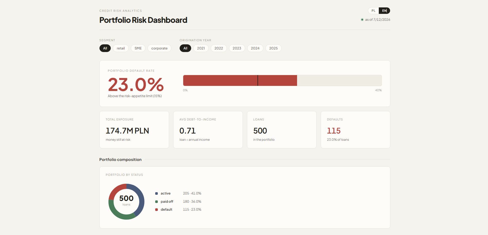
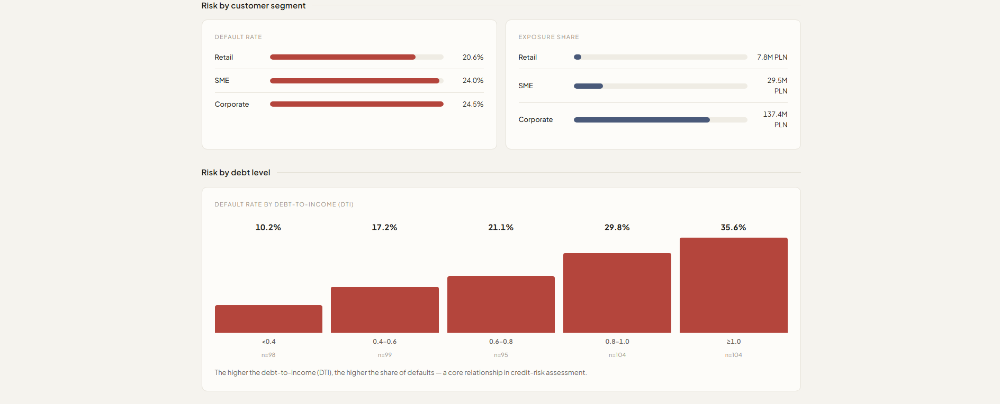
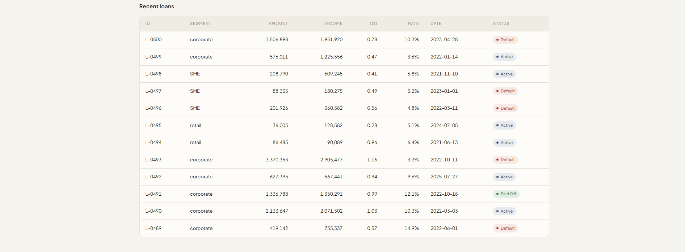

# Credit Risk Dashboard

A full-stack web application for analyzing the credit risk of a loan portfolio.
It shows how a bank measures and visualizes risk: default rates, exposure, and
how risk differs across customer segments and debt levels. The interface is
available in **Polish and English**.



## What it does

The dashboard turns a portfolio of loans into the numbers a risk analyst cares
about, and lets you drill into them:

- **Portfolio default rate** measured against a **risk-appetite limit** — the
  headline number turns red when the portfolio breaches the limit.
- **KPI tiles**: total exposure (money still at risk), average debt-to-income,
  loan count, and number of defaults.
- **Portfolio composition** — share of loans by status (active / paid off / default).
- **Risk by customer segment** — default rate and exposure share for retail, SME
  and corporate clients.
- **Risk by debt level** — default rate across debt-to-income (DTI) bands, which
  visualizes the core relationship *more leverage → more defaults*.
- **Recent loans** table with per-loan detail and status.
- **Filtering** by customer segment and origination year — the whole view
  recomputes.





## How it works

The app is split into a **backend** (the "kitchen" that prepares the data) and a
**frontend** (what you see in the browser). They talk over a small **REST API**.

```
 Browser (React)  ──HTTP──▶  Express API  ──SQL──▶  SQLite database
   dashboard UI              /api/metrics           loans table
                             /api/loans
```

1. **Data lives in a SQLite database.** On first start the backend creates a
   `loans` table and seeds it with a realistic sample portfolio of 500 loans,
   where the probability of default rises with the borrower's debt-to-income
   ratio — so the charts show a real signal, not noise.
2. **The API serves two endpoints.** `GET /api/loans` returns the (optionally
   filtered) portfolio; `GET /api/metrics` returns the computed risk metrics,
   overall and per segment.
3. **Metrics are computed on the server** by small, pure functions that take a
   list of loans and return numbers (default rate, exposure, average DTI). They
   are decoupled from the data source, so swapping the in-memory data for the
   database required no change to the risk math.
4. **The frontend fetches those endpoints** when it loads and whenever a filter
   changes, then renders the gauge, tiles, charts and table from the response.

## What makes each feature work

| Feature | What powers it |
| --- | --- |
| Data that survives a restart | **SQLite** via Node's built-in `node:sqlite` |
| Filtering by segment / year | URL **query parameters** + **parameterized SQL** (`WHERE`), which is also safe from SQL injection |
| Reusable risk calculations | **pure TypeScript functions**, decoupled from the database |
| Interactive dashboard | **React** with hooks (`useState` / `useEffect`) that refetch on filter change |
| Charts (gauge, donut, DTI bars) | hand-built **SVG / CSS** components — no chart library |
| Polish / English switch | a lightweight **i18n** layer (React **Context** + a translation dictionary), with the choice saved to `localStorage` |
| Bugs caught before runtime | **TypeScript** types shared across the whole app (API response → UI) |
| No CORS issues in development | a **Vite dev-server proxy** forwarding `/api` to the backend |

## Tech stack

| Layer    | Technology                     |
| -------- | ------------------------------ |
| Frontend | React + TypeScript (Vite)      |
| Backend  | Node.js + Express + TypeScript |
| Database | SQLite (`node:sqlite`)         |
| Tooling  | Git, npm                       |

## Running locally

Requires Node.js 22+ (for the built-in SQLite module).

```bash
# 1. Backend — starts the API on http://localhost:4000
cd server
npm install
npm run dev

# 2. Frontend — in a second terminal, starts the app on http://localhost:5173
cd client
npm install
npm run dev
```

Then open **http://localhost:5173**. The database is created and seeded
automatically on first run.

## Project structure

```
credit-risk-dashboard/
├── server/                 # backend (Node + Express + TypeScript)
│   └── src/
│       ├── index.ts        # API endpoints
│       ├── db.ts           # SQLite layer (create, seed, query)
│       ├── metrics.ts      # pure risk-metric calculations
│       ├── types.ts        # domain model (Loan, RiskMetrics, ...)
│       └── data/           # sample-portfolio generator
└── client/                 # frontend (React + TypeScript + Vite)
    └── src/
        ├── App.tsx         # dashboard layout + data fetching
        ├── i18n.tsx        # PL / EN translations + language context
        ├── format.ts       # locale-aware number/currency formatting
        └── components/     # gauge, tiles, charts, filters, table
```

## Author

Krystian Fijałkowski
